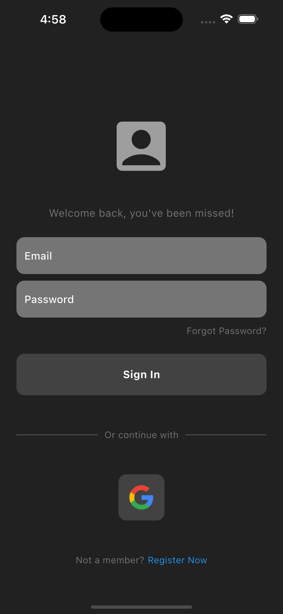
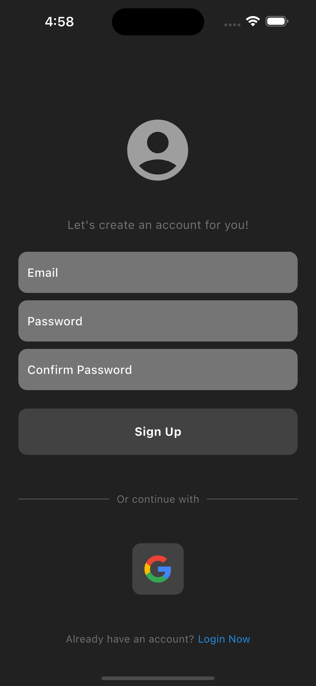
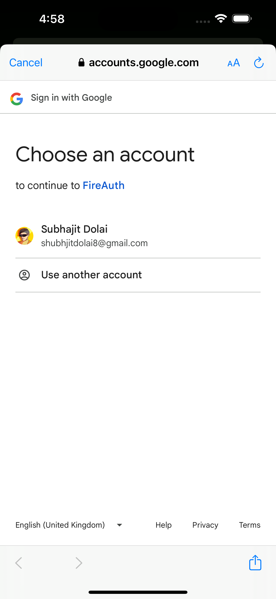

# FireAuth

**FireAuth** is a Flutter app demonstrating Firebase Authentication integration. This app features a modern, minimalistic UI with two pages: a login page and a "register now" page. The project showcases email/password authentication and Google Sign-In/Log-In. It's built as a demo to highlight my learning journey with Flutter and Firebase.

## Features

- **Email/Password Authentication**: Users can register with their email and password or log in if they already have an account.
- **Google Sign-In/Log-In**: Simplifies the login process using Google accounts.
- **Modern, Minimal UI**: A clean, user-friendly interface that ensures a seamless user experience.

## Screenshots

  
  
  

### Download Links

- **Android APK**: [Download APK](https://github.com/SubhajitDolai/FireAuth/releases/tag/v1.0.0)

## Dependencies

- [Flutter](https://flutter.dev/) - A framework for building natively compiled applications for mobile, web, and desktop from a single codebase.
- [firebase_core](https://pub.dev/packages/firebase_core) - A core package required for Firebase integration.
- [firebase_auth](https://pub.dev/packages/firebase_auth) - Firebase Authentication for managing user sign-up and sign-in.
- [google_sign_in](https://pub.dev/packages/google_sign_in) - A package that allows users to sign in with Google.

## How It Works

The app is designed to simplify user authentication using Firebase. Users can register with their email or log in with their existing credentials. Additionally, Google Sign-In is available for a faster login experience. Firebase Authentication manages the user sessions, ensuring secure access to the app.

## Contributing

Contributions are welcome! If you have suggestions or improvements, feel free to open an issue or submit a pull request.